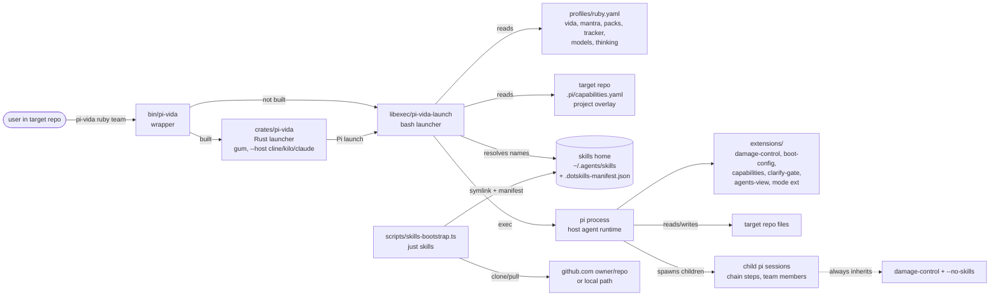
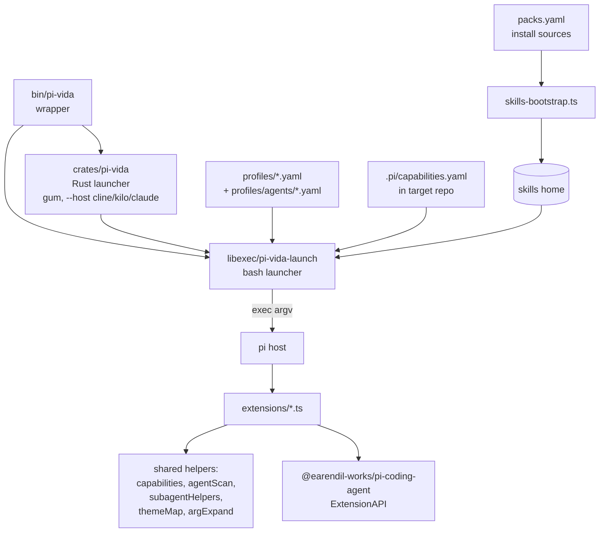
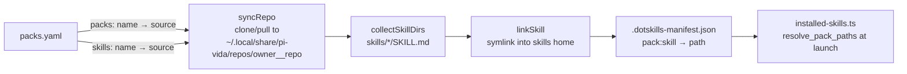

# pi-vida architecture

## Summary

pi-vida is a launcher and extension set for the Pi coding agent. It turns a
per-language profile (`profiles/<vida>.yaml`) into one `pi` invocation: a fixed
extension stack, a `--no-skills` flag, and `--skill` arguments for exactly the
skills the profile allowlists. The source of truth for what a vida loads is the
profile YAML; the source of truth for where skills come from is `packs.yaml`
plus the skills home (`PI_SKILLS_HOME`, default `~/.agents/skills`).

**INV-skills**: every session, including dispatched children, starts with
`-e extensions/damage-control-continue.ts --no-skills` and only allowlisted
`--skill` paths. `libexec/pi-vida-launch` enforces it for the primary session;
`extensions/subagentHelpers.ts` enforces it in `buildChildArgv` for every child
`pi` spawn. No code path may launch a session without the damage-control gate.

### System architecture



`bin/pi-vida` is a wrapper: it execs `crates/pi-vida/target/release/pi-vida`
(the Rust launcher, built with `just build`) when that binary exists, else
`libexec/pi-vida-launch` (the bash launcher). The Rust binary runs the
interactive gum flow and the non-Pi `--host cline|kilo|claude` path, then
delegates Pi invocations back to the bash launcher. The bash launcher shells
out to `bun` only to parse YAML (profiles, overlay, manifest) through
`extensions/capabilities.ts` and `extensions/installed-skills.ts`, then `exec`s
`pi` with the assembled argv.

### Dependency hierarchy



Dependencies point down only. Extensions never invoke the launcher; the
launcher reaches extension code only through `bun -e` imports of the pure
parser modules (`capabilities.ts`, `installed-skills.ts`). Helper modules are
leaf libraries: they import node builtins and `yaml`, never other extensions'
entry points. `themeMap.applyExtensionDefaults` is the one shared runtime
concern (theme + terminal title); the first `-e` extension wins.

## Launch pipeline

`launch_life` in `libexec/pi-vida-launch` builds the argv in a fixed order. Each step can
fail closed (exit 2) before `pi` starts.

```mermaid
sequenceDiagram
    participant U as user
    participant PL as pi-vida
    participant B as bun parsers
    participant SH as skills home
    participant PI as pi

    U->>PL: pi-vida ruby team
    PL->>PL: canonical_life (rails→ruby; ecto/rails-python exit 2)
    PL->>PL: base argv: -e damage-control, boot-config,<br/>capabilities, clarify-gate, agents-view, --no-skills (+ mode ext)
    PL->>B: read_profile(profiles/ruby.yaml)
    B-->>PL: TSV rows: kind⇥name[⇥value]
    loop each row
        PL->>SH: mantra/tracker: dir must exist (else exit 2)
        PL->>B: pack: resolve_pack_paths via installed-skills.ts
        B-->>PL: manifest paths, legacy fallback, or exit 2
    end
    PL->>B: read_overlay(cwd/.pi/capabilities.yaml)
    B-->>PL: overlay JSON (missing file = all off; bad YAML = exit 2)
    PL->>B: merge_overlay_roles (profile models/thinking under overlay)
    PL->>PL: export PI_OVERLAY, PI_VIDA_HOME, PI_VIDA, MY_PI_AGENT_HOME, PI_LIFE
    PL->>PI: exec pi <argv>
    PI->>PI: session_start: boot-config wizard if no overlay file,<br/>then capabilities prompt gate, clarify gate armed
```

Order matters:

1. `damage-control-continue.ts` is always first so the tool gate exists before
   any other extension runs.
2. `boot-config.ts` runs before `capabilities.ts` so the first-launch wizard
   can update `PI_OVERLAY` in the same session (handler order = `-e` order).
3. `clarify-gate.ts` then `agents-view.ts` are always loaded after
   `capabilities.ts`; `agents-view.ts` registers the `/agents` command and
   `resolvedAgentsView` in every mode.
4. Mode extensions are mutually exclusive by construction: solo adds
   `status-line.ts`, chain adds `agent-chain.ts`, team adds `agent-team.ts`,
   fusion adds the vendored `fusion-harness` with `--fh-config`. The launcher
   never loads two, so `setActiveTools` calls cannot conflict.
5. Herdr worker members (`PI_VIDA_WORKER`) get a reduced base argv instead:
   `damage-control-continue.ts`, `capabilities.ts`, `team-member.ts`, and
   `--no-skills`, with no boot-config, clarify-gate, status-line, or
   agent-team.
6. `--skill` paths come only from `add_named_skill` (profile names resolved
   under the skills home) and `add_overlay_skill` (overlay `extra_skills` and
   `tracker.skill`, resolved against the target repo cwd, warn-only).

### Fail-closed contract

Exit 2 before launch on: invalid profile or overlay YAML, a missing mantra or
configured-tracker skill dir, a malformed `.dotskills-manifest.json`, a
manifest entry whose `SKILL.md` is missing, or a resolver/bun failure. Missing
packs warn and launch continues. `tracker: none` or an omitted tracker loads no
tracker skill. `pi` missing on PATH exits 127 after argv assembly.

## Skills provisioning

`just skills` runs `scripts/skills-bootstrap.ts`. It reads `packs.yaml`, which
maps each allowlisted name to `owner/repo` or an absolute local path.



Rules the bootstrap enforces:

- Repo cache dirs are `owner__repo`, so two repos named `skills` never collide.
- A non-symlink dir in the skills home is never overwritten; it counts as
  installed. A stale symlink (target deleted) is relinked.
- The manifest is merged over any existing file, preserving entries written by
  other installers (dotskills). A manifest that fails the schema check aborts
  the run instead of being overwritten.
- Only skills whose `SKILL.md` exists in the skills home are recorded, so a
  recorded-but-missing skill cannot pass launch resolution.

At launch, `resolve_pack_paths` consults the manifest first. Status 1 (no
entries for that pack) falls back to the legacy `<skills_home>/<pack>` dir;
status 2 (invalid manifest or resolver failure) fails closed.

## Extensions

Each extension is `export default function (pi: ExtensionAPI)`. Extensions that
render UI check `ctx.hasUI` and no-op in print/JSON mode.

| Extension | Owns | Does not own |
|---|---|---|
| `damage-control-continue.ts` | Tool-call gate: blocked tools get feedback, the turn continues (no `ctx.abort()`). Rules from `<cwd>/.pi/damage-control-rules.yaml` when present (project override), else harness `damage-control-rules.yaml`; an invalid project file warns and falls back. | Skill selection, launch args |
| `boot-config.ts` | First-launch wizard: writes `.pi/capabilities.yaml` on confirm, updates `PI_OVERLAY` in-session, applies solo model/thinking. Skipped when `PI_OVERLAY_EXISTS=1` or no UI. | Overlay parsing (that is `capabilities.ts`) |
| `capabilities.ts` | Overlay schema and parser (`parseOverlayDoc`, strict: unknown keys and non-booleans throw), role-map validation shared with `read_profile`, prompt-gate entry point. | Writing the overlay file |
| `clarify-gate.ts` | Blocks `write`/`edit` until `/clarify`; read-only tools stay open. Per-session, opens permanently. Skipped without UI. | Prompt content (the `clarify` skill drives that) |
| `status-line.ts` | Turn counter footer, solo mode only. | Chain/team modes |
| `agent-chain.ts` | `/chain`, `/chain-list`, `run_chain` tool. Chain YAML discovery: cwd `.pi/agents/` → `profiles/<vida>/agents/` → shared `profiles/agents/`, first file wins. | Team dispatch |
| `agent-team.ts` | Dispatcher-only primary: `setActiveTools([dispatch_agent])` at `session_start` (pi 0.85 forbids action methods during load). Only members of the active team dispatch. | Chain execution |
| `agents-view.ts` | `/agents` command (loaded in every mode) and `resolvedAgentsView`, the shared resolved-agents view behind the CLI inspector and the team list formatter. | Launch args |
| `team-member.ts` | Herdr worker persona bootstrap; loaded only in `PI_VIDA_WORKER` member panes via the member base argv. | Primary-session tools |
| `subagent.ts` + `subagentHelpers.ts` | `subagent` tool (single/parallel/chain modes) and `buildChildArgv`, the single place child `pi` argv is built. Not loaded by `pi-vida` yet. | Primary-session tools |
| `installed-skills.ts` | `.dotskills-manifest.json` schema check and pack→paths resolution CLI used by `resolve_pack_paths`. | Installing skills |
| `agentScan.ts` | Agent/command/skill discovery for agent defs: `profiles/<vida>/agents/` → `profiles/agents/` → cwd `.pi/` → `.claude/.gemini/.codex` fallbacks, first-wins on name. Shared by `cross-agent`, `system-select`, `subagent`, `agent-chain`. Note: the chain *file* itself uses `resolveChainFile`, whose order puts the project `.pi/agents/` first. | Launch policy |
| `cross-agent.ts`, `system-select.ts`, `minimal.ts`, `purpose-gate.ts` | Standalone extensions, loadable via `pi -e` but not wired into `pi-vida`. | Launch wiring |
| `fusion-harness/` | Vendored multi-model stack runner (MIT, disler/fusion-harness). Stack `primary` slot becomes the host model. | Profile/overlay merging |

## Child sessions

Chain steps, team members, and subagent tasks all spawn child `pi` processes
through `subagentHelpers.buildChildArgv`. The builder hard-codes
`-e <harness>/extensions/damage-control-continue.ts --no-skills` as the first
argv tokens, so no caller can spawn an ungated child. Per-role model and
thinking come from the merged `PI_OVERLAY` (profile defaults under overlay
overrides), keyed on the child's agent name (`planner`, `builder`, `reviewer`,
`researcher`), falling back to the primary's current model.

## Trust boundaries and invariants

- **INV-skills** (above) is the load-bearing rule. Enforced by
  `libexec/pi-vida-launch` argv construction and `buildChildArgv`.
- **Profiles and overlay are untrusted input.** Both parse through strict
  validators in `capabilities.ts`; malformed YAML exits 2 before `pi` starts.
- **The manifest is untrusted.** `installed-skills.ts` rejects non-schema-1
  documents, non-string paths, paths outside the flat-install shape, missing
  `SKILL.md` files, and duplicate resolved paths.
- **Secrets never enter the repo.** `DEEPSEEK_API_KEY` lives in the environment
  or `~/.config/rs-guard/env`; `check_excludesfile` in doctor verifies git
  excludes cover `.env`, `.pi/agent-sessions/`, and tool output dirs.
- **Diagnostics go to stderr; reports go to stdout.** `doctor_warn` prefixes
  `warning: ` line by line. `--dry-run` prints the argv on stdout and
  `PI_OVERLAY` on stderr.
- **Herdr is a host with a prompt-only exception (INV-herdr #79, amends
  #19).** `herdr agent start <name> --kind pi -- pi-vida <vida>` runs
  pi-vida inside Herdr; `pi-vida <vida> team` under `HERDR_ENV=1` splits one
  pane per member and dispatches via `herdr agent prompt --wait` / `agent
  read` against `PI_HERDR_MEMBERS` only. Outside Herdr (or `HERDR_ENV`
  unset) team dispatch stays hidden-child + kill, and extensions never shell
  out to `herdr`. The `herdr` mantra skill no-ops when `HERDR_ENV` is
  unset.

## Source map

| Concept | Authoritative file |
|---|---|
| Wrapper (Rust-vs-bash dispatch) | `bin/pi-vida` |
| Rust launcher (gum flow, `--host cline|kilo|claude`) | `crates/pi-vida/src/cli.rs`, `crates/pi-vida/src/hosts.rs` |
| Launch argv, fail-closed rules, doctor | `libexec/pi-vida-launch` |
| Profile schema (mantra/packs/tracker/models/thinking) | `profiles/*.yaml`, `read_profile` in `libexec/pi-vida-launch` |
| Resolved agents view (`/agents`, inspector) | `extensions/agents-view.ts` |
| Overlay schema and merge | `extensions/capabilities.ts` |
| Pack manifest resolution | `extensions/installed-skills.ts` |
| Skill install sources | `packs.yaml`, `scripts/skills-bootstrap.ts` |
| Child argv contract | `extensions/subagentHelpers.ts` (`buildChildArgv`) |
| Herdr team panes (INV-herdr) | `libexec/pi-vida-launch` (`start_herdr_team`), `extensions/agent-team.ts` (`herdrDispatch`) |
| Member persona bootstrap | `extensions/team-member.ts` |
| Chain/team definitions | `profiles/agents/agent-chain.yaml` |
| Damage-control rules | `damage-control-rules.yaml` |
| Domain glossary | `CONTEXT.md` |
| Usage guide | `docs/how-to.md` |

## Verification

- `just smoke`: end-to-end: extension `bun test` suite, `bun build` of every
  entry point, damage-control unit checks, doctor sweep against an empty
  skills home (deduped warnings, exit 0), a bootstrap → manifest →
  `resolve_pack_paths` round-trip through a local fixture pack, and a
  synthetic-Rails fixture run.
- `bun test scripts/skills-bootstrap.test.ts`: parser, plan, cache-dir, and
  manifest filtering units.
- `scripts/test-dotskills-install.sh`: real dotskills install → pi-vida
  resolution (requires a dotskills checkout).
- `pi-vida --dry-run <vida> <mode>`: prints the exact argv without launching.

Evidence gap: the vendored `fusion-harness` internals are covered by its own
`tests/` directory, not by harness assertions; treat its behavior as upstream.
