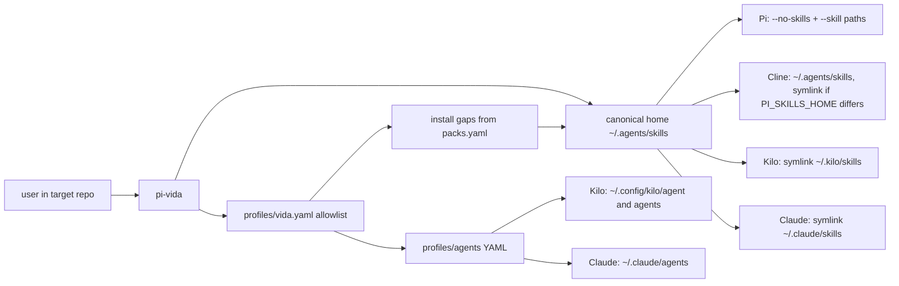

# Host-aware vida

> **Status:** Proposed for review

This is the product contract for the gum/Rust launcher (issue #82). The repo, binary, and profile glossary were renamed to `pi-vida`/`vida` in #75; this document uses those names throughout.

Current Pi launch, skills home, and INV-skills: [ARCHITECTURE.md](../../ARCHITECTURE.md).

## 1. Requirements: what and why

Cline, Kilo, Claude Code, and Pi all load `SKILL.md` directories, from different folders, with different launch rules. Without a written contract, the Rust launcher will argue about skill identity, host names, YAML keys, and whether a host is wrapped or merely pointed at.

The user is someone who already has a vida profile (ruby, rust, elixir, python) and wants those skills on the host they are actually using. The outcome: one command picks host and vida, installs gaps from `packs.yaml`, projects the allowlist into the host's folders, then starts that host or prints how to start it.

Required:

- One canonical skill identity and one canonical skills home.
- Vida profile YAML as the allowlist (mantra + packs + tracker).
- A projector per host so Pi keeps INV-skills, and Cline/Kilo/Claude Code see the same allowlisted `SKILL.md` trees.
- Interactive gum (dotskills-style) and a non-interactive path that needs no gum.
- Personas stay YAML in `profiles/agents/`; Kilo and Claude get markdown only when `--host` needs it.

Out of scope here (other tickets own them):

- Renaming the GitHub repo or `bin/pi-vida` (shipped in #75).
- Implementing the Rust/gum binary (#82).
- The agents inspector (#81).
- Onboarding docs for other people (#78).
- Rewriting Pi extensions in Rust.
- Vendoring [dotskills](https://github.com/igmarin/dotskills) (reference it; do not merge the git repo).
- Cloning Cline or Kilo as the product.
- Writing skills or agents into the target repo.
- Windows paths.
- A fusion stack editor (gum asks for a path; it does not edit YAML).
- Herdr pane layout. Herdr stays a multiplexer that runs `pi-vida`; it is not a `--host` value. Chain panes wait on a later team-panes follow-up.

## 2. User experience

The user runs `pi-vida` from the **target repo**, as they do with `bin/pi-vida` today.

### CLI

```text
pi-vida [--dry-run] [--host pi|cline|kilo|claude] [vida] [mode] [fusion-stack]
pi-vida doctor [vida]          # unchanged bash doctor
```

- Default `--host` is `pi`.
- Vidas: `rust`, `elixir`, `ruby`, `python`. Aliases: `phoenix` → `elixir`, `rails` → `ruby`. `ecto` and `rails-python` exit 2 with `use ruby or python` (same text as today, with "vida" once #75 lands).
- Modes `solo` (default), `chain`, `team`, `fusion` are **Pi only**. Fusion still needs exactly one stack file.
- `--host cline|kilo|claude` rejects a mode or fusion-stack argument (exit 2): those hosts do not load Pi extensions, chains, teams, or fusion.
- `--dump-overlay` stays Pi-only (exit 2 on any other host).
- `doctor` ignores this design; `pi-vida doctor --host …` exits 2 (`doctor` is not host-aware).
- `-h`, `--help`, and `help` print usage and exit 0, even on a TTY with no vida (gum does not start).
- Unknown host, unknown vida, unknown flag: exit 2.
- Flags may appear before or after `vida`. No passthrough of extra host flags in this version.
- Diagnostics (warnings, errors, gum install hint) go to stderr. The exec command, dry-run argv, and start-hint line go to stdout.

Examples:

```sh
pi-vida                         # TTY + gum: pick host, vida, (Pi) mode, confirm, install, exec or print
pi-vida ruby team               # no gum; Pi; INV-skills argv as today
pi-vida ruby --host kilo        # install/project, then exec kilo or print a start hint
pi-vida --dry-run ruby --host cline
```

### Interactive (TTY, no vida argument)

Gum runs only when **no vida argument** is given and the invocation is not `help` / `doctor` / `--dump-overlay`. `pi-vida ruby` on a TTY is non-interactive Pi solo, same as today.

Requires `gum` on PATH. If gum is missing: exit 2 with an install hint (do not fall back to a custom TUI; do not vendor Charm as a library). Shell out to `gum` the way dotskills does.

If stdin is not a TTY and there is no vida argument: print usage, exit 2.

If `--host` is already set, skip the host menu and start at vida.

Menu order:

1. Host: `pi`, `cline`, `kilo`, `claude` (labels may say "Claude Code"; the value is `claude`).
2. Vida: the four vidas (show aliases in the label if useful; stored value is the canonical vida).
3. Mode, **only if host is `pi`**: `solo`, `chain`, `team`, `fusion`. If fusion, gum text-input for a stack path relative to cwd; empty or missing file exits 2.
4. Confirm packs: print the profile allowlist **names** (mantra, packs, tracker or "none") and `gum confirm`. Decline: exit 0, change nothing.
5. Install missing **allowlisted** names from `packs.yaml` (not every pack in that file).
6. Run the host projector.
7. Exec or print (below).

### Non-interactive

`pi-vida ruby team` does not start gum. Host defaults to `pi`. Pi does **not** auto-install; missing mantra or configured tracker still exits 2 (today's contract).

`pi-vida ruby --host kilo` (and cline/claude) does not start gum either. It installs missing allowlisted skills, projects, then execs or prints.

### Exec or print

| Host | Binary on PATH | Otherwise |
|---|---|---|
| `pi` | `exec` the INV-skills `pi` argv in the target-repo cwd | exit 127 (`pi not found on PATH`), after argv assembly |
| `kilo` | `exec kilo` in the target-repo cwd, no extra flags | print one stdout line: `skills projected to ~/.kilo/skills; run: kilo` and exit 0 |
| `claude` | `exec claude` in the target-repo cwd, no extra flags | print `skills projected to ~/.claude/skills; run: claude` and exit 0 |
| `cline` | `exec cline` in the target-repo cwd, no extra flags | print `skills projected to <cline-global>; run: cline` and exit 0, where `<cline-global>` is `~/.agents/skills` (Cline's recommended global dir, even when `PI_SKILLS_HOME` points elsewhere) |

`--dry-run` never installs, never writes persona files, never execs. It prints the command (or the print-hint line) that would run, plus the projected skill paths on stdout. Pi dry-run still fail-closes on missing mantra/tracker (same as `pi-life --dry-run`). Other hosts warn on still-missing names and still print.

### Empty, invalid, denied, failed

- Cancel gum / decline confirm: exit 0, no installs, no projection, no exec.
- Invalid profile YAML, both `vida:` and `life:` set to different values, malformed `packs.yaml`, malformed `.dotskills-manifest.json`: exit 2.
- Install clone/pull failure: exit 2, leave the skills home as the bootstrap already does (no partial manifest write that fails schema).
- Pi missing mantra or configured tracker after resolution: exit 2. Missing pack: warn on stderr, continue.
- Other hosts: missing names after install warn on stderr; projection of what exists continues; then exec or print (no exit 2 for a missing mantra).
- Projector finds a non-symlink directory where it would put a skill: skip that name, warn, continue. Never overwrite it.
- Projector finds a persona file without the managed marker: skip that name, warn, continue.
- Host binary missing on Pi: exit 127. Other hosts: print hint, exit 0.

Cline, Kilo, and Claude Code discover every skill in their folders. The allowlist decides what this command **installs and projects**. It does not hide a skill already sitting in `~/.kilo/skills`, `~/.claude/skills`, or `~/.agents/skills` from another vida. Cline's recommended global dir is `~/.agents/skills`; when that is also the canonical home, Cline sees every skill already installed there, not only this vida's allowlist. That is accepted.

## 3. Technical design and choices

`pi-vida` is a launcher. Pi remains the only host that loads this repo's extensions. Cline, Kilo, and Claude Code keep their own loops; this command only installs, projects, and execs or prints.

### Invariants

**INV-skills** (unchanged, Pi only). Every Pi session, including children, starts with `-e extensions/damage-control-continue.ts --no-skills` and only allowlisted `--skill` paths. Damage-control stays first. No copy of skills into a Pi-specific folder. Overlay `extra_skills` / `tracker.skill` stay Pi-only, warn-only if missing, same as today.

**INV-1 Identity.** A skill is a directory that contains `SKILL.md`. The skill name is the directory name. That matches [agentskills.io](https://agentskills.io/specification) (`name` must match the parent directory). Frontmatter `name` is the skill's problem when it disagrees; the launcher keys on the directory.

**INV-2 Home.** Canonical home is `PI_SKILLS_HOME` if set, else `~/.agents/skills` (Cline's recommended global path). Repo cache stays `${PI_VIDA_REPOS:-~/.local/share/pi-vida/repos}` (`PI_LIFE_REPOS` legacy fallback), per `scripts/skills-bootstrap.ts`. Do not add a second cache.

**INV-3 Allowlist.** `profiles/<vida>.yaml` is the allowlist: `mantra`, `packs`, `tracker`. The launched vida is the filename plus `canonical_life` (aliases), not a field inside the file. Key `vida:` is the name to write; `life:` is still parsed. Either key alone is enough; do not compare it to the CLI name. Both present and equal: accept. Both present and different: exit 2. Neither key: still valid if the mapping of mantra/packs/tracker (and optional models/thinking) parses. Packs resolve through `.dotskills-manifest.json` (`<pack>:<name>` → flat dir name) when the manifest exists; malformed manifest or a recorded skill missing `SKILL.md` exits 2; a pack with no manifest entries falls back to `<home>/<pack>`. Shipping `vida:` in the YAML files is #75, not #82.

**INV-4 Projector safety.** Pi never copies or symlinks into a host skills dir. Cline/Kilo/Claude project by symlink from the canonical home. Never overwrite a non-symlink directory. Never delete a skill this command did not create. Never write into the target repo (no `.kilo/`, `.claude/`, or `.agents/` under cwd).

**INV-5 Host boundary.** `--host` is how Cline, Kilo, and Claude Code enter. The launcher does not inject Pi extensions, overlay, clarify-gate, or damage-control into those processes. It does not wrap their REPL. Herdr is not a `--host` value; example remains `herdr agent start <name> --kind pi -- pi-vida <vida>`.

**INV-6 Fail closed vs warn.** Invalid YAML / manifest: always exit 2. Pi mantra and configured tracker: exit 2 if the dir is missing. Packs: warn, continue, every host. Other hosts do not inherit Pi's mantra/tracker exit 2 after install.

**INV-7 Install.** Sources are `packs.yaml` (`packs:` and `skills:` → `owner/repo` or an absolute path). Install only names on the selected vida's allowlist (mantra, that vida's packs, tracker), not every entry in `packs.yaml`. Idempotent. Never overwrite a non-symlink dir in the skills home; it still counts as installed. Relink a stale symlink. Merge `.dotskills-manifest.json` schema 1; abort rather than overwrite a document that fails the schema check. Filter the existing bootstrap plan/link/manifest behavior by that allowlist; do not invent a second resolver. `just skills` stays the documented install entry and still provisions the full `packs.yaml` set. #82 may reimplement the installer in Rust as long as this contract holds. Launcher install failures exit 2 (Pi fail-closed), even if today's `skills-bootstrap.ts` exits 1. Do not call `npx skills` in v1 (avoids a Node install path the Rust binary should not need).

### Host projectors

One resolver, every host. Build the same absolute path list Pi already uses for `--skill`: each mantra dir, each path from `resolve_pack_paths` for that vida's packs, and the tracker dir unless omitted/`none`. Do **not** project overlay `extra_skills` / `tracker.skill` (Pi-only, added later on the Pi argv). Do **not** symlink a pack's own directory name unless that name is in the resolved list (a `rails-agent-skills` folder is not a substitute for the pack's member skills).

Canonical skill path: `<home>/<name>/SKILL.md` where `<name>` is the resolved directory (INV-1).

| Host | Skill visibility | How |
|---|---|---|
| **Pi** | `--skill <absolute path>` after `--no-skills` | No copy. INV-skills argv from [ARCHITECTURE.md](../../ARCHITECTURE.md). |
| **Cline** | `~/.agents/skills/<name>/` (Cline's recommended global dir, **not** necessarily `PI_SKILLS_HOME`) | If canonical home **is** `~/.agents/skills`, project nothing extra. If `PI_SKILLS_HOME` is another path, symlink each resolved dir into `~/.agents/skills/<name>`. Do **not** also link `~/.cline/skills` in v1: current Cline loads both globals, so a second link duplicates. Legacy-only `~/.cline/skills` is leftover §5. |
| **Kilo** | `~/.kilo/skills/<name>/` | Symlink each resolved dir. Create `~/.kilo/skills` as needed. |
| **Claude Code** | `~/.claude/skills/<name>/` | Symlink each resolved dir. Create `~/.claude/skills` as needed. |

Symlink rules (Kilo, Claude, optional Cline extra):

1. Destination missing: `symlink` with an **absolute** target of the canonical directory.
2. Destination is a symlink: relink if the target is not that absolute path.
3. Destination exists and is not a symlink: warn, skip, do not replace.

Do not prune leftover symlinks from another vida. Last successful project of a given name wins the symlink target.

### Personas

Source of truth: YAML under `profiles/<vida>/agents/` then `profiles/agents/`, first-wins on `name`. Skip `agent-chain.yaml`. Do not scan cwd `.pi/agents/` or `.claude/.gemini/.codex` for non-Pi hosts (that discovery stays Pi).

Harness files today look like:

```yaml
name: planner
description: Architecture and implementation planning
tools: read, grep, find, ls
body: |
  You are a planner agent. ...
```

Pi: leave YAML in place. `cross-agent` / `system-select` stay unwired until a later ticket.

`--host cline`: write no persona files.

`--host claude`: write `~/.claude/agents/<name>.md` (user-level, not `.claude/agents/` in the target repo).

`--host kilo`: write the same markdown to both global dirs Kilo documents, because `mode: all` must show in the primary picker **and** as a subagent, and the two doc pages disagree on the folder name:

- `~/.config/kilo/agent/<name>.md` (singular; custom-modes global)
- `~/.config/kilo/agents/<name>.md` (plural; custom-subagents global)

Filename minus `.md` is the agent name. Apply the managed-marker rule independently on each path. Do not write `.kilo/agent` or `.kilo/agents` in the target repo.

Managed marker: the markdown body begins with `<!-- pi-vida-projected -->`. Refresh the file when the marker is present. If the destination exists without the marker: warn, skip. If absent: write.

Claude file:

```markdown
---
name: planner
description: Architecture and implementation planning
tools: Read, Grep, Glob
---
<!-- pi-vida-projected -->
You are a planner agent. ...
```

Kilo file (`mode: all` so the user can select it as primary or subagent):

```markdown
---
description: Architecture and implementation planning
mode: all
permission:
  read: allow
  edit: deny
  bash: deny
---
<!-- pi-vida-projected -->
You are a planner agent. ...
```

Tool mapping from the YAML `tools` list (comma list or array). Empty tools: Claude omits `tools` (inherit); Kilo omits `permission` (host default).

| Profile YAML | Claude `tools` | Kilo `permission` |
|---|---|---|
| `read` | `Read` | `read: allow` |
| `grep` | `Grep` | (no extra key; discovery via Read) |
| `find`, `ls` | `Glob` | (no extra key) |
| `write`, `edit` | `Write`, `Edit` | `edit: allow` |
| `bash` | `Bash` | `bash: allow` |

Kilo `edit`/`bash` default to `deny` when those profile tools are absent, so a planner with only read/grep/find/ls cannot edit. Never emit a Kilo key for `grep` / `find` / `ls` (no `grep: deny`); omit them so host defaults remain. Unknown profile tool names are dropped with a stderr warning.

Do not project overlay role `models:`/`thinking:` into host agent files. Hosts pick their own models.

### Technology for #82 (not this ticket)

- Rust binary, crate/binary name `pi-vida` (`pi_vida` lib name if Cargo requires it), after #75.
- Interactive path shells out to `gum`; require gum on PATH; do not vendor Charm.
- YAML profiles stay YAML (`yaml` crate). No TOML for profiles, overlay, or damage-control.
- Doctor may remain bash.
- Pi argv assembly must keep matching `just smoke` INV-skills checks.

Rejected: ratatui; a second skills home per host; copying skill trees (symlink); wrapping Cline/Kilo/Claude; `npx skills` as the Kilo projector.

### Failure, security, operations

- Profile and overlay YAML are untrusted; keep strict parse, exit 2.
- `packs.yaml` is harness-authored; clone only those `owner/repo` values (or the absolute path smoke uses). No user-supplied git URL on this command.
- Secrets stay out of the repo. Projection writes only symlinks and persona markdown from existing YAML bodies.
- Home-directory writes are limited to: skills home (install), `~/.agents/skills` when it is not the canonical home (Cline), `~/.kilo/skills`, `~/.claude/skills`, `~/.claude/agents`, `~/.config/kilo/agent`, `~/.config/kilo/agents`.
- Personal-machine scale (dozens of skills). No new network except git clone/pull during install.
- `--dry-run` is the rollback preview. Projection is additive; the user can delete managed symlinks and marked persona files.



## 4. Acceptance and proof

Proof belongs to #82 except AC-1 (this document). Keep these IDs stable.

| ID | Done when | How to check |
|---|---|---|
| AC-1 | This file exists at `docs/host-aware-vida/design.md` with a projector table, INV-* rules, and only non-blocking leftovers in Open questions | Path present; a new teammate can explain Pi vs Kilo launch from §2 without reading §3 |
| AC-2 | `pi-vida --dry-run ruby team` matches INV-skills (damage-control first, `--no-skills`, only allowlisted `--skill`) | `just smoke` argv assertions on the Pi path |
| AC-3 | `pi-vida --dry-run ruby --host cline` prints a `cline` invocation or a hint naming `~/.agents/skills`; no Pi `-e` flags | Dry-run stdout; grep must not find `damage-control-continue` |
| AC-4 | `pi-vida --dry-run ruby --host kilo` names `~/.kilo/skills` and `kilo`; same for `claude` / `~/.claude/skills` | Dry-run stdout |
| AC-13 | Non-Pi projectors use the **resolved** Pi `--skill` path list, not pack keys | `PI_SKILLS_HOME` fixture with `ruby-core-skills:some-skill` in the manifest; `pi-vida --dry-run ruby --host kilo` names that skill dir under `~/.kilo/skills`, not only `ruby-core-skills` |
| AC-14 | Cline still projects into `~/.agents/skills` when `PI_SKILLS_HOME` is another directory | Dry-run with `PI_SKILLS_HOME=/tmp/skills-home`; stdout names `~/.agents/skills/<resolved>` |
| AC-15 | Only `vida:` or only `life:` in a profile launches; neither key also launches when mantra/packs parse | Profile fixtures; contrast AC-12 (both keys different → exit 2) |
| AC-5 | Non-interactive `ruby` / `ruby team` / `doctor` work with gum missing | PATH without gum; those commands still run |
| AC-6 | Interactive with no gum and no args exits 2 with an install hint | `pi-vida` on a TTY, gum removed |
| AC-7 | Install is idempotent and never replaces a non-symlink skill dir | Unit test: pre-existing directory kept; stale symlink relinked; manifest schema 1 merge |
| AC-8 | Pi missing mantra or configured tracker exits 2; missing pack warns | Dry-run with empty skills home for those names |
| AC-9 | `--host kilo team` (mode on a non-Pi host) exits 2 | Command status and stderr |
| AC-10 | Persona markdown for Kilo/Claude is written only when `--host` is that host, only with the managed marker, and never into the target repo | After a non-dry-run project: files under `~/.config/kilo/agent` **and** `~/.config/kilo/agents`, or `~/.claude/agents`; cwd has no new `.kilo/` / `.claude/` |
| AC-11 | A pre-existing non-marked `~/.claude/agents/planner.md` is left intact | Fixture + stderr warning |
| AC-12 | `vida:` and `life:` both set to `ruby` launches; set to different values exits 2 | Profile fixture |

## 5. Open questions

None blocking. Recorded leftovers:

1. **Herdr team panes, then chain panes.** This design does not start extra panes. A later ticket can `herdr agent start` per team member after the skill projector exists. Chain panes wait on that. Does not block #82.
2. **Cline CLI quality.** `exec cline` is best-effort; many installs are the VS Code extension only. The print hint is the supported fallback. Does not block #82.
3. **Legacy Cline `~/.cline/skills`.** v1 only projects to `~/.agents/skills` so modern Cline does not see duplicates. If a user still on a Cline that only scans `~/.cline/skills` reports missing skills, extra-link that dir then. Does not block #82.
